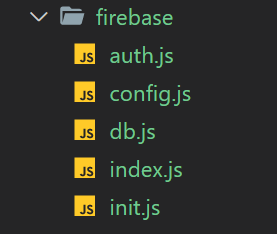

# Google Firebase : Backend as a Service

Google's [Firebase](https://cloud.google.com/firestore/docs/client/get-firebase) is a mobile/web **b**ackend **a**s **a** **s**ervice (**BaaS**).

> "Mobile backend as a service is a model for providing web app and mobile app developers with a way to link their applications to backend cloud storage and APIs exposed by back end applications while also providing features such as user management, push notifications, and integration with social networking services." - [_Wikipedia_](https://en.wikipedia.org/wiki/Mobile_backend_as_a_service)

It is _not_ just a third party library like Navigo or Axios, but an entire **platform** with _a lot_ of services available for us to use. We will focus on **Firestore** (a real-time NoSQL database) and **Auth** (a ready-to-use client-side authenticator), but there are many more services on Firebase that may be of interest:

- Analytics
- Messaging/Notifications
- Hosting
- Machine Learning
- Testing
- Ad services

<br>

---

<br>

## Getting Started with Firebase

<br>

### **Creating a Project**

1. Sign-in to Firebase using your Google account.
2. Click "Get started", then "Add a project" to create a new Firebase project
3. Enter a project name. This name is just for your reference
4. We won't be using Analytics, and it is optional, but enabling Analytics won't hurt anything
   - If you enable Analytics, you must choose an Analytics account to link to your project. Default is fine
5. Click "Create project" to create your Firebase project

<br>

### **Register an App**

After creating a new Firebase project, you will be on the project's Overview page. We have our Firebase project set-up, but our app/website is not linked to it yet.

1. We need to add our app to Firebase
   - Without any apps linked to our project, the Overview page reads: "Get started by adding Firebase to your app". Click the Web icon ( `</br>` ) to add a web app/site.
   - Or, click the "gear"/settings icon in the top left corner next to "Project Overview", and select "Project settings". On the Settings page, under "Your apps", select the Web icon ( `</>` )
2. Register your website/app with a nickname (again, this name is just for your reference)
3. Skip the next step where it tells you to paste the `<script>` tags into your HTML document. Our architecture will handle this differently

<br>

---

<br>

## Set-up Firebase: Auth and Firestore

<br>

### **Set-up Authentication**

1. Select "Authentication" from the list under "Develop" on the left side of your Firebase project page.
2. Select the "Sign-in method" tab and enable "Email/Password" and/or any other types of Authentication you want use

<br>

### **Set-up Firestore**

1. Select "Database" from the list under "Develop" on the left side of your Firebase project page.
2. Click "Create database", and start your database in "test mode". In test mode, **anyone** can read or write data to your database for thirty days. Learn more about securing your database [here](https://firebase.google.com/docs/firestore/security/get-started).
3. Set your location/timezone and Firestore creates your cloud database.
   > **Firestore Data Model**
   >
   > "Firestore is a NoSQL, document-oriented database. Unlike a SQL database, there are no tables or rows. Instead, you store data in documents, which are organized into collections.
   >
   > Each document contains a set of key-value pairs. Cloud Firestore is optimized for storing large collections of small documents.
   >
   > All documents must be stored in collections. Documents can contain subcollections and nested objects, both of which can include primitive fields like strings or complex objects like lists." - [Firebase docs](https://firebase.google.com/docs/firestore/data-model)
4. After we've created our database, we click "+ Start collection" to create our first collection/"table".
5. Give your collection a name/ID, then create the collection's first document by specifying fields (keys), types, and values, and saving
6. Our database is now set-up with a collection and a document. We can manually add more documents and/or collections, or we can add documents and/or collections to our database later through JavaScript
7. Our Firebase project is now set-up, and we can move on to setting-up and working with Firebase in our project repo

<br>

---

<br>

## Set-up Firebase in Our Repo

<br>

### **Install Firebase**

We can [install Firebase](https://www.npmjs.com/package/firebase) like any other dependency by entering the following into the terminal:

```
npm install --save firebase
```

<br>

---

<br>

## Firebase Architecture



<br>

## `firebase/config.js`

Our `config.js` file will `export` our config object. To find the config object for your Firebase project, click the "gear"/settings icon next to "Project Overview", then select "Project settings". Under "Your apps", we have the same code snippet we skipped over earlier. Copy the object that is set equal to `firebaseConfig`, paste it into your config file, and export it by default.

<br>

> **TIP**: To use environment variables, remember to import your `env.js` file to gain access to `process.env`.

```javascript
export default {
  apiKey: process.env.FIREBASE_API,
  authDomain: "savvycoders-practice.firebaseapp.com",
  databaseURL: "https://savvycoders-practice.firebaseio.com",
  projectId: "savvycoders-practice",
  storageBucket: "savvycoders-practice.appspot.com",
  messagingSenderId: "433839277019",
  appId: process.env.FIREBASE_ID,
  measurementId: "G-4HLEQEN2HS",
};
```

<br>

## `firebase/init.js`

Our `init.js` file initializes Firebase with our config settings. We `import` our Firebase app and config Object, then export the result of calling the `initializeApp()` method on our Firebase app and passing in our config Object.

```javascript
import firebase from "@firebase/app";
import config from "./config";

export default firebase.initializeApp(config);
```

<br>

## `firebase/auth.js`

Now that we have our Firebase app initialized, we can set-up our authorization and database modules. We simply import the authentication piece of Firebase and our initialized Firebase app, then export the result of calling `auth()` on our app.

```javascript
import "@firebase/auth";
import firebase from "./init";

export default firebase.auth();
```

<br>

## `firebase/db.js`

The database module is very similar to our `auth` module, only we import a different piece of Firebase and call a different method on our app.

```javascript
import "@firebase/firestore";
import firebase from "./init";

export default firebase.firestore();
```

<br>

## `firebase/index.js`

Our `index.js` is an aggregator that exports our `auth` and `db` modules.

```javascript
export { default as auth } from "./auth";
export { default as db } from "./db";
```

<br>

---

<br>

## Using Firebase in JavaScript

<br>

### **Using `auth`**

[Get Started with Firebase Authentication](https://firebase.google.com/docs/auth/web/start)

```javascript
// remember: auth = firebase.auth()
import auth from "./firebase";

// register new user from email and password
auth.createUserWithEmailAndPassword(email, password);

// sign in existing user
auth.signInWithEmailAndPassword(email, password);

// user sign out
auth.signOut(callback);

// listen for change in authorization status
auth.onAuthStateChanged((user) => {
  console.log(user);
});
```

<br>

> [Managing Users in Firebase](https://firebase.google.com/docs/auth/web/manage-users)

<br>

### **Using `db`**

[Get started with Firestore](https://firebase.google.com/docs/firestore/quickstart)

- [**C**reating / **U**pdating Firestore Data](https://firebase.google.com/docs/firestore/manage-data/add-data)
- [**R**eading Firestore Data](https://firebase.google.com/docs/firestore/query-data/get-data)
- [**D**eleting Firestore Data](https://firebase.google.com/docs/firestore/manage-data/delete-data)

```javascript
// remember: db = firebase.firestore()
import db from "./firebase"

// select a collection
const coll = db.collection( /* collection name */ )

// create a new document in a collection
coll.add({ /* document Object */ })

// read all documents from a collection
// "snapshot" represents the state of the collection at the time we called get()
coll.get().then(collectionSnapshot => collectionSnapshot.docs.forEach(doc => console.log(doc.data())))

// read a single document from a collection
// "snapshot" represents the state of the document at the time we called get()
coll.doc( /* document ID */ ).get().then(documentSnapshot => console.log(documentSnapshot.data()))

// update a document in a collection
coll.doc( /* document ID */ ).update({ /* key */ : /* value */})

// delete a document in a collection
coll.doc( /* document ID */ ).delete()
```

<br>

> [Get realtime database updates with Firestore](https://firebase.google.com/docs/firestore/query-data/listen)

<br>

---

<br>

## SPA Example

### [SPA Example with Firebase](https://github.com/savvy-coders/SPA-example-with-Firebase)
