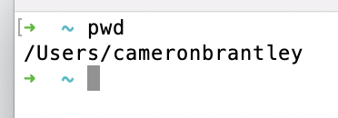
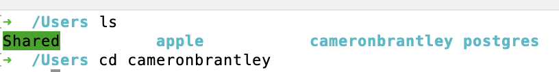

# Understanding GitBash Commands

When looking at the directory in your terminal, think of the folders on your computer. Here are some pictures of the folders on my computer:

You can see that I am in the Users folder. In that folder, there are three files: apple, cameronbrantley, and Shared. Inside the folder cameronbrantley, there is a list of files and folders. Here is the same folder from my terminal:

The main difference in the terminal is that I couldn’t simply click on the files. I had to tell the computer exactly what files to look into. I used the command “cd” to move between folders and “ls” to list all the files inside a folder. Here is a more detailed explanation of these commands:

## Some Basic Terminal Commands

### pwd - Print Working Directory

- On the previous page, I found a list of several items inside the folder “cameronbrantley”
- If you follow the first picture from left to right, you see that I started in the “Users” folder, then looked in the folder “cameronbrantley”
- When I type this in the terminal, this path is what is printed (or simply typed out for me to see)

### cd - Change Directory

- On the previous page, you can see that I used this command to change the folder I wanted to look in.
- I started in the Users folder, but wanted to see what was in the folder “cameronbrantley”
- When I was in the Users folder, I typed “cd cameronbrantley”

### cd ~ - Move to home directory (same as just cd)

### cd .. - Move up one directory
When you are inside the folder “cameronbrantley” but want to go back to the folder “Users”

### cd folderName - Move down into folder

- When you are in a folder, and want to see what is inside
- I can look in “Shared” by typing “cd Shared”

### ls - List files in current/working directory

See what is inside the folders

- You can access each of the folders inside this Shared folder.
- ls -a - list all files (including hidden files); the -a is a flag that indicates the specific way we want to run the command

### mkdir folderName - Make Directory (Create Folder)

- Make a new folder inside the folder
- I created a new folder called Hi inside the “Shared” Folder. You can see that is now located in this folder by listing the folders inside “Shared”

## touch fileName - Create new File

From the “Users” directory, I moved into the new “Hello” folder that I created
This is an empty folder now. I created a new file “howdy.js”
You can see when I list the files inside this folder that it is now inside the Hello folder.

### cat fileName - Preview file contents directly in terminal

### history - Print log of all previous commands

#### TIP: Take advantage of 'auto-completion.' Type the first few characters of a file or directory name then press 'Tab.' The command prompt will try to complete the name or give you a list of possible choices.

#### TIP: Press 'Up Arrow' to bring up previously typed commands.
