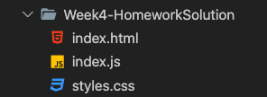

# Homework and Goals

## Goal: _Mastery of these Skills_

- The DOM Tree & Node Relationships, and working with elements in the DOM
- Events & Event Handling
- Methods for working with JS array content, and combining arrays
- JS `.forEach()`, `.map()`, `.filter()`, and `.reduce()` methods
- JS Step Debugging in VS Code

 

## Goal: _Capstone work_

- Continue building out your capstone HTML
- Add an `About` and `Contact` page, and style these with CSS

 

## Homework is due to your TA by next Monday before class

 

## HTML & JS homework set-up

1. Add a "Week 4 Homework" _folder_ to your homework repo
2. Inside the folder, create `index.html` and `index.js` files
3. Populate the `index.html` with boilerplate starter HTML
4. Link your JS file to your HTML file with a `<script>` tag.

### Build an informational Website

> **GOAL**: Create a website that informs a visitor about something. The website should be readable and look nice: the website's basic appearance matters more than the particular content.
>
> You could create the beginnings of a professional portfolio website highlighting your career path and skills, or you could create a website that simply displays information about something you are interested in.

### Include the Following HTML

- Updated title tag
- Header, Main, and Footer sections
- 2+ lists
- 2+ headings
- 1+ paragraph
- 1+ image
- 2+ links

### Include the Following CSS

- utilize the CSS Box Model for padding, margin, and border
- utilize a color scheme (max. 4 colors)
- 1+ class selector
- 1+ ID selector
- 1+ complex selector

## Bonus Challenge

> **GOAL**: Use JavaScript _DOM methods_ to populate some to "all" of your HTML from a `.js` file instead of "hard coding" your HTML into your `index.html` file.

An example of the file structure you should have for this assignment is

