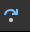

# Step Debugging Javascript with Visual Studio Code

## How we all get started debugging, `console.log`

```javascript
console.log('Hello World');
```

This is ok for simple application logic but as your logic becomes more advanced it requires more `console.log` statements which become overwhelming.
They also don't demonstrate runtime values well.  They really only display values after execution.

As complexity grows console becomes too verbose:

```javascript
console.log('function begin', variable);
console.log('function end', variable);
console.group();
    console.log('another function begin', variable);
    console.log('another function end', variable);
    // Numerous other console.log calls
console.groupEnd();
```

### Advantages & Disadvantages of console.log

- Easy (NO) setup
- Have to add code wherever you need output
- The output is only after execution has completed
- There is no way to update the variable values interactively
- There is no way to pause execution interactively
- Requires clean up code once debugging completed

## What is Step Debugging?

Step Debugging is an interactive connection between the IDE and browser allowing the IDE to control the JavaScript execution within the browser.

### Advantages & Disadvantages of Step Debugging

- Harder to setup initially
- Can evaluate variable values during execution
- Can update the variable values interactively
- Can pause execution interactively, using breakpoints
- Can debug compiled code referencing the source code such as TypeScript or Elm
- No clean up required

## Getting VS Code ready for Step Debugging

### Prerequisites

1. Install [Debugger for Chrome extension](https://marketplace.visualstudio.com/items?itemName=msjsdiag.debugger-for-chrome)
2. Restart VS Code
3. If you don't already have live-server, install it globally
    1. `npm install -g live-server`

### Configuration

1. Click Run -> Add Configuration -> Chrome: Preview
    1. If you don't have that option an alternate method: Click Run -> Open Configuration -> Chrome: Preview

    ```json
    {
        "version": "0.2.0",
        "configurations": [
            {
                "type": "chrome",
                "request": "launch",
                "name": "Launch Chrome against localhost",
                "url": "http://localhost:8080",
                "webRoot": "${workspaceFolder}"
            }
        ]
    }
    ```

2. Restart VS Code

#### Where is the configuration stored

By default, the launch configuration is stored in project in the .vscode folder

The launch configuration can be stored across projects (globally) in the settings.json under the "launch" key.

### Sample Parcel Configuration

```json
{
    "type": "chrome",
    "request": "launch",
    "name": "Launch Chrome w/Parcel",
    "url": "http://localhost:1234",
    "webRoot": "${workspaceFolder}",
    "trace": true,
    "breakOnLoad": true,
    "sourceMapPathOverrides": {
        "*": "${webroot}/src/*"
    }
}
```

## Setup the development environment

- Open a terminal in the root of your repository folder
- Serve your code via live-server
- `live-server .`

## Start Step Debugging


### Debugger Operations


- Pause/Continue 
    -- Pause or continue the execution of the code will stop at the next breakpoint
- Step Over 
    -- Execute the current line without introspection
- Step Into 
    -- Execute the current line, "diving" into any scopes (functions)
- Step Out 
    -- Execute the code "climbing out" of the current scope
- Restart 
    -- Reset the debugging session, including refreshing the browser
- Stop 
    -- End the debugging session, code execution will continue

## Demo

[Sample code, instructions and configuration](https://github.com/matsinet/step-debugger-walk-through)

## What's next

### Documentation

[Visual Studio Code Manual : Debugging](https://code.visualstudio.com/docs/editor/debugging)

### Video Tutorial

[Debugging JavaScript (Google Chrome and Visual Studio Code)](https://www.youtube.com/watch?v=AX7uybwukkk)
