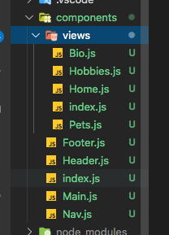
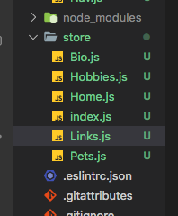
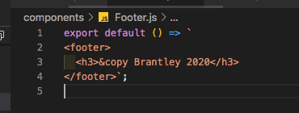
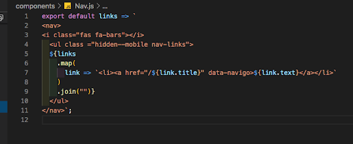
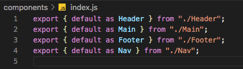
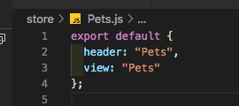

# Creating an SPA (Single Page Application)

## The advantage of using a Single Page Application is giving the user the ability to more quickly navigate on your page.

Before creating an SPA, first create your project as a single HTML. Here is an example of a project as a single HTML:

 

## You can see that inside this single HTML Boilerplate that there are sections.

These are the different pieces of state that you will be using in your SPA. To prepare to convert this to an SPA, create three folders -- These are components, views, and store.

 

## To create the folders, Click on the root directory to add the components and store folders. The views folder should go inside the components folder.

When you do this, your file directory should look similar to this:

 

## Inside the Components folder, create the files Footer.js, Header.js, Main.js, Nav.js, and index.js.

The Components folder will look like this:

 

## Inside the Views folders, you want to create a page for each piece of state the user will be able to see.

So I will create Home.js, Bio.js, Hobbies.js, Pets.js, and index.js. The Views folder will look like this:

 

## The store file contains the same files as the views folder with some important additions.

The files I will put in my stores folder are Home.js, Bio.js, Hobbies.js, Pets.js, Links.js, and index.js. This should look similar to:

 

## Now the fun part! Let’s go back to your home index.html file where all of your code currently is.

Highlight all of the code between the body tags. (In my case, this is lines 9-43) Copy the code and delete it.

Navigate to the components folder and select the Main.js file. Paste all of the code that you copied from the index.html file into this file.

In the place of the deleted code on the index.html file, enter code so it looks like:

 

## Navigate back to your components folder and click on the Main.js file.

Copy each section into its appropriate views file. (I will copy from the starting to the ending section tag for bio, copy this code and paste it into the Bio.js file)

 

## Hit return to force each of these pages to start the lines of code on line 2.

On line 1, write “export default () => ` “ This starts the template literal, place the closing template literal after the ending section tag.

 

## In the views index.js file, export all of the views pages. Mine looks like this:

You are now done with the views file. Close this on your navigation bar.

 

## Now look through your components files. In the Footer.js file, and each file inside of it, export each file. Here is mine:

 

## Now look at your header file. You want it to look the same no matter what page you are viewing. Do this by:

 

## In your now empty Main.js, you want to import all of the pages from the views folder that you created.

You then want to display that particular view, this can be done through:

 

## The Links.js folder inside the store folder will look like:

 

## Nav.js in the components folder will use the links file we will create in the store folder. The information you need is:

 

## Finally, export all of the files in the components folder in the index.js file. This looks like:

Now you’re finished with the components file.

 

## Move down to the store file in your directory. In this file you are exporting each page and giving it a name.

For each of the files, write code similar to:

 

## In the index.js file in the store folder, export all of the files in the store folder. Do this by:

 

## You’ve created all of your files now!

## Go to index.js to add functionality to your navigation bar and your CSS file to make it look pretty!
