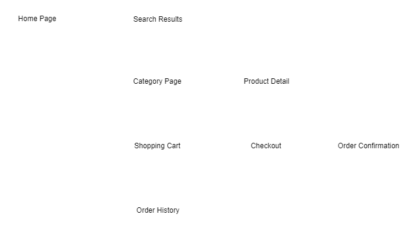

# Project Planning
### The steps to planning your project successfully

---

## Define your Audience

#### Who is the target audience for the capstone project? ####

- It's not you!
- Mentor & Peers
- Recruiters & Career Coaches
- Hiring Managers
- Ultimately the consumer of your product

---

## Define your Project

#### What is an appropriate capstone project? ####

- Why manufacture a car with an expensive paint job without an engine? Consider your audience, do they want you to build static web pages or an application that solves a problem or accomplishes a task?

Should display your development skills and creativity in a professional manner.

Can be completed in the allotted time frame you have to commit.

#### Determine what YOUR project will be. ####
Write a sentence that start with "I want to create a web APPLICATION that..."

"I want to create a web APPLICATION that allows users to ask questions via chat during a talk and add resources to videos."

#### Create a high level story you want tell with your project. ####

This will be your elevator pitch for you capstone project and used during demo day.

---

## Define your Content

#### Determine what pages you need and the content of each page. ####

- Don't worry about look and feel or style of the content, that comes later.

1. Make a list of pages
1. Write a brief description of the content for each page
    1. Navigation
    1. Main Content
    1. Footer

---

## Define your User Flow ##

#### What interactions will the user be required to do to use your web application. ####

Example: E-commerce Application

- Focus on page flow not content of pages
- Make sure you analyze all user flows, creating multiple flow charts if necessary.

---

## Create Wire Frames ##

#### Now that you think you know what you want to create.

- The wireframes should be crude.  We are not creating comps.
- Start with pencil and paper or whiteboard
   - Then if desired, move into a digital version.
- Create at least one per page.
   - If a page has suffocated user interaction, multiple wireframes for a single page may be required.
- Create wireframes for both different screen sizes.  I.E.: mobile and desktop.
- They should be proportionally correct.
- They should identify the content to be placed on each page but not display actual content.
- They should annotate any user interactions.

#### Start with pencil and paper or whiteboard, then if necessary create a digital version

  
   
  

#### Tools ####

Analog Tools:

- Pencil & Paper
- Whiteboard & Dry Erase Markers

Digital Tools:

- Draw.io ([https://www.draw.io/](https://www.draw.io/)) <=- Recommend 
- Adobe XD ([https://www.adobe.com/products/xd.html](https://www.adobe.com/products/xd.html))
- Inkscape ([https://inkscape.org/](https://inkscape.org/))
- Adobe Illustrator ([https://www.adobe.com/products/illustrator.html](https://www.adobe.com/products/illustrator.html))
- Mockflow ([https://mockflow.com/](https://mockflow.com/))
- JustInMind ([https://www.justinmind.com](https://www.justinmind.com))
