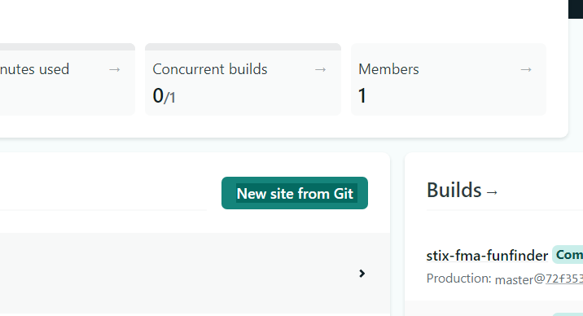
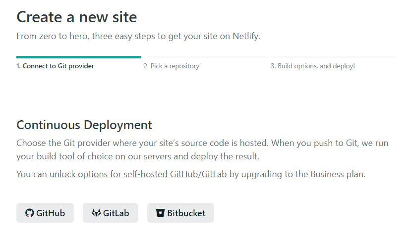
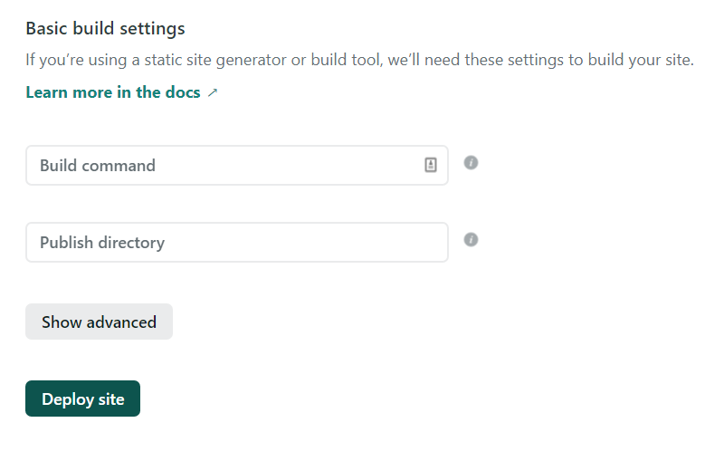
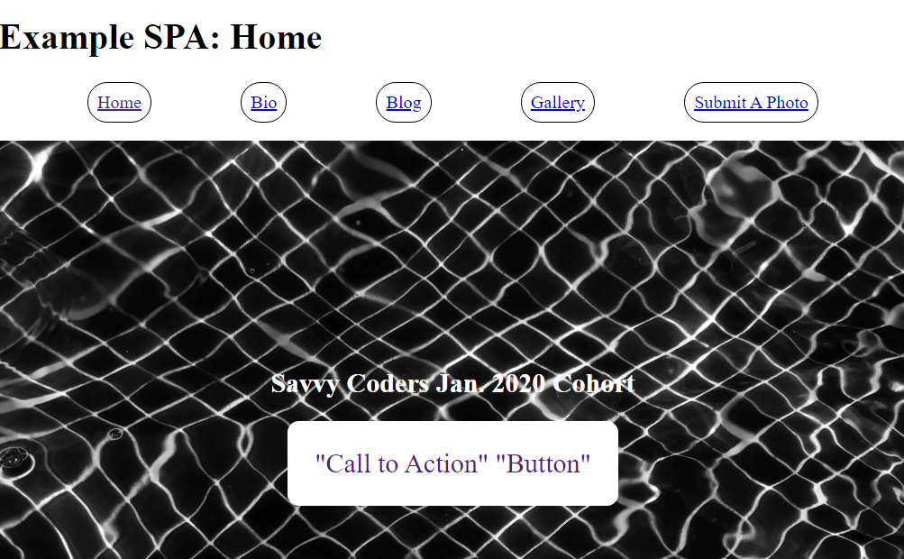

# Deploying Your Site To Netlify

## 1. Sign-up or log-in to Netlify

 

## 2. Click "New site from Git"

 

## 3. Under "Continuous Deploy" select the GitHub icon

 

## 4. Under "Continuous Deploy: GitHub App" choose your repo

1.  Give Netlify access to your repo(s)
2.  Save
3.  Select a branch (`master`)

 

## 5. Under "Basic Build setting" configure your deploy settings

    - Enter our build command: `npm run parcel-build`
    - Our publish directory is `./dist`
    - In the advanced settings, we can define our "hidden" environment variables

 

## 6. Deploy the site and customize your domain name -- under 'site overview' -> 'site settings' -- while Netlify builds your site.

 

## 7. We now have a [live website](https://savvycoders-spa-example.netlify.com/) that anyone can access!

